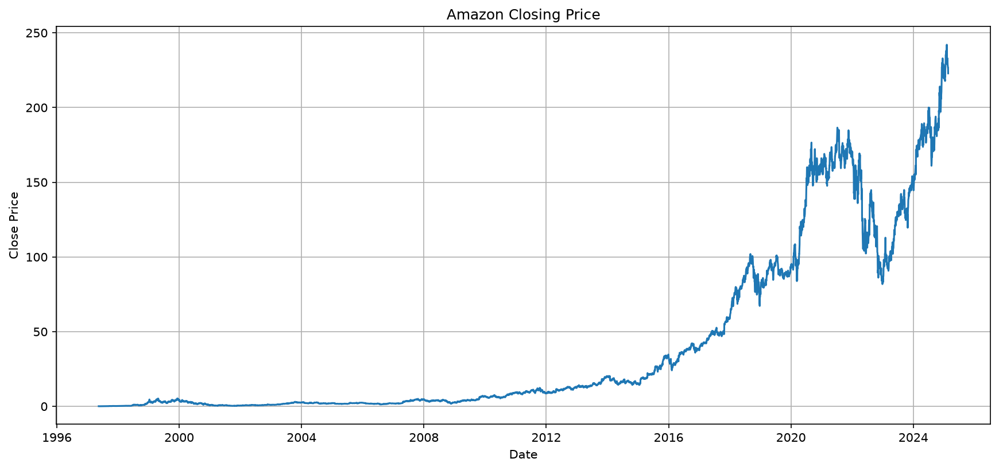
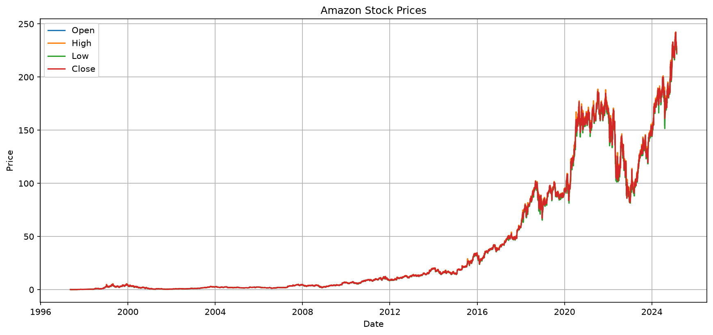
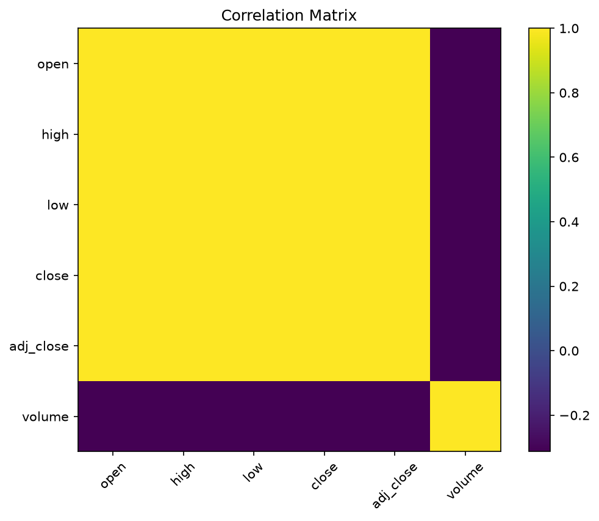
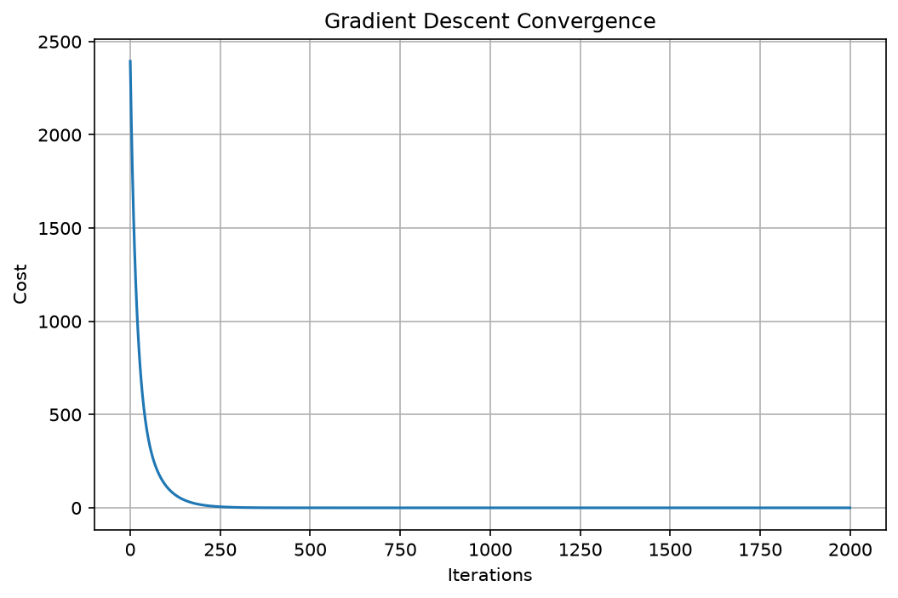
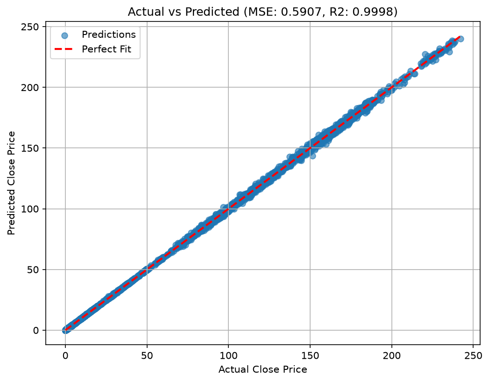

# Stock Prediction Model: Custom Linear Regression

A clean, from-scratch implementation of multivariate Linear Regression optimized via Gradient Descent to predict Amazon stock closing prices. This project includes exploratory data analysis (EDA), custom feature scaling, model evaluation with metrics like Mean Squared Error (MSE) and $R^2$ (R-squared), and an interactive CLI for historical lookups and custom predictions.

This project was built from scratch without relying on high-level ML libraries like `scikit-learn` or `PyTorch` for model training, highlighting core implementation skills in mathematical optimization and gradient descent.

## 🚀 Key Features

* **Exploratory Data Analysis (EDA)**: Automatic generation of correlation matrices, feature histograms, and trend visualizations.
* **From-Scratch Gradient Descent**: Custom implementation of cost function, gradient computation, and gradient descent optimization.
* **Feature Standardization**: Vectorized features scaled using mean ($\mu$) and standard deviation ($\sigma$).
* **Evaluation Metrics**: Tracks MSE and $R^2$ coefficient of determination to measure predictions.
* **Interactive CLI Tool**: 
  1. Retrieve trading days' actual data and predict prices.
  2. Input custom Open, High, Low, and Volume parameters to compute closing price forecasts.
* **Headless Plot Exporter**: CLI flag `--save-only` to generate and save all plots non-interactively to the `results/` directory.

---

## 📈 Model Performance

After training for `2000` iterations with a learning rate ($\alpha$) of `0.01`:
* **Mean Squared Error (MSE)**: `0.5907`
* **R-squared ($R^2$)**: `0.9998` (Indicating the model fits the historical stock price relationships exceptionally well)

---

## 📊 Visualizations & Results

### 1. Amazon Closing Price Trend
Shows the historical closing price trend of Amazon stock.


### 2. Open, High, Low, Close (OHLC) Overview
Overlaps the stock price parameters over the timeline.


### 3. Correlation Matrix
Visualizes relationships between various numeric features. Note the very high correlation between Open, High, Low, and Close prices.


### 4. Gradient Descent Convergence
Shows the optimization process of the cost function over epochs, demonstrating smooth convergence.


### 5. Actual vs. Predicted Price
A scatter plot comparing actual closing prices to predicted values. The regression line aligns closely with the perfect diagonal (ideal fit).


---

## 🛠️ Tech Stack & Requirements

* **Language**: Python 3
* **Libraries**: `numpy`, `pandas`, `matplotlib`

To install dependencies:
```bash
pip install numpy pandas matplotlib
```

---

## 💻 How to Run

### Interactive CLI Mode
Run the script to train the model, view the plots, and launch the interactive lookup tool:
```bash
python3 main.py
```

### Save Plots Non-Interactively
To generate all results and save them directly to the `results/` directory without opening plot windows:
```bash
python3 main.py --save-only
```
This is ideal for headless environments or server deployments.

---

## 📂 Repository Structure

```
├── Amazon.csv         # Stock price dataset
├── main.py            # Primary model code (EDA, Training, CLI)
├── README.md          # Project details and walkthrough
└── results/           # Saved visualization plots (images)
    ├── actual_vs_predicted.png
    ├── closing_price.png
    ├── correlation_matrix.png
    ├── gradient_descent_convergence.png
    ├── histograms.png
    ├── open_vs_close.png
    └── stock_prices.png
```
